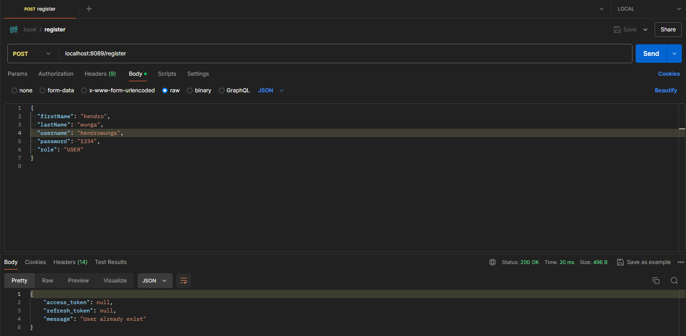
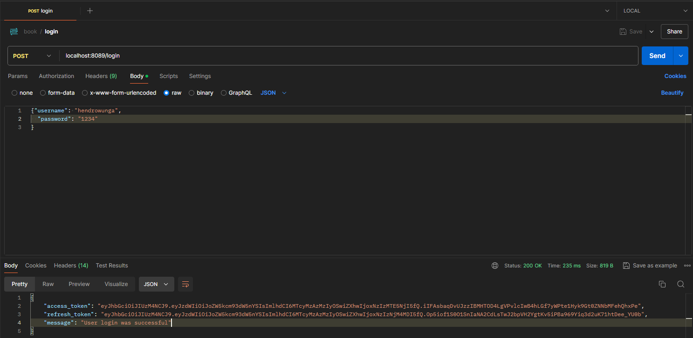
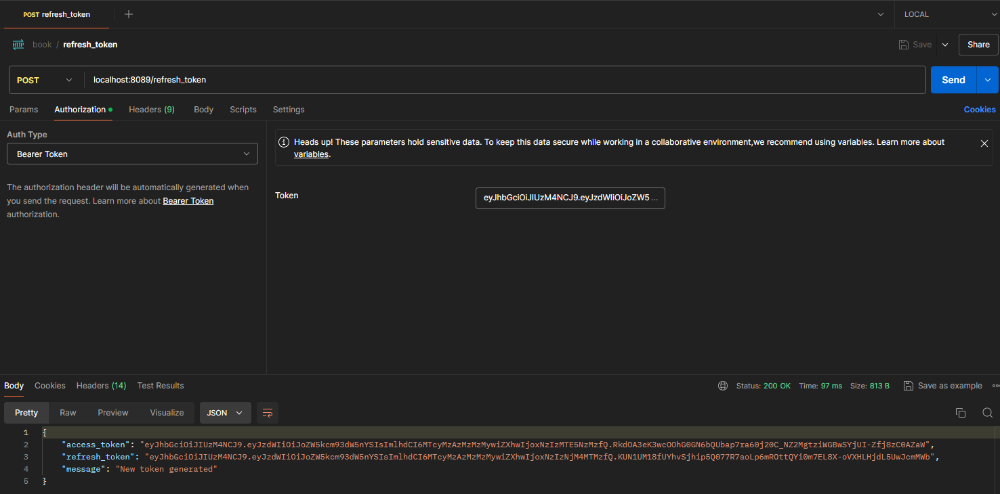
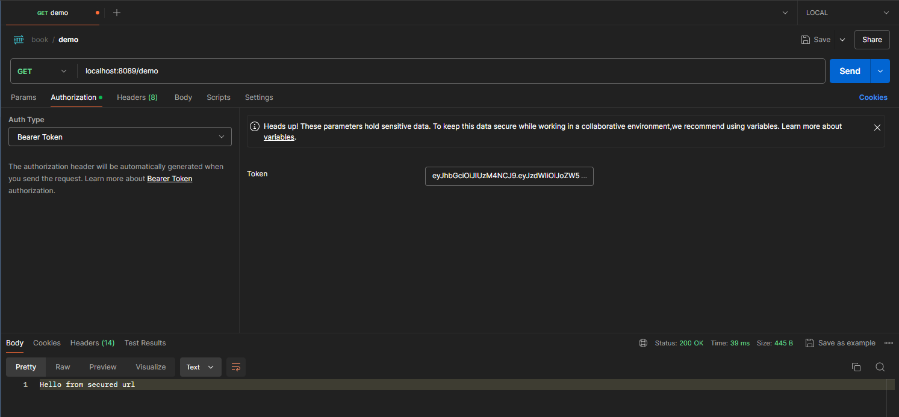
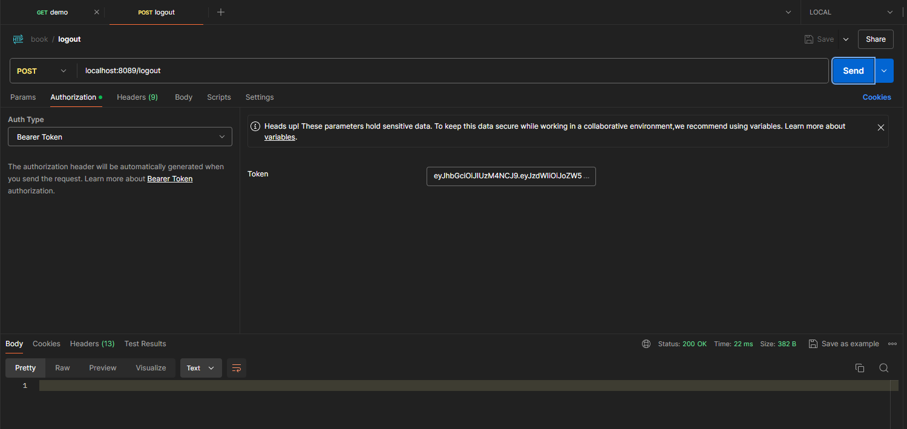

## Spring JWT

This project is designed to implement a refresh token mechanism that allows users to obtain a new access token when their access token has expired. Here are some key features of this project:

### Register
Users can register a new account by submitting the required information through the registration endpoint.

### Login
Users can log into their account by submitting valid credentials through the login endpoint. Upon success, they will receive an access token and a refresh token.

### Refresh Token
If the user's access token has expired, they can use the refresh token to obtain a new access token without needing to log in again.

### Demo
A demonstration of how this application works, including the registration process, login, using the access token, and the refresh token process.

### Logout
Users can log out of their account, which will invalidate the existing tokens and end their session.

This project is designed to ensure that users can easily maintain access to services, even after their access token has expired, through the secure and efficient use of refresh tokens.